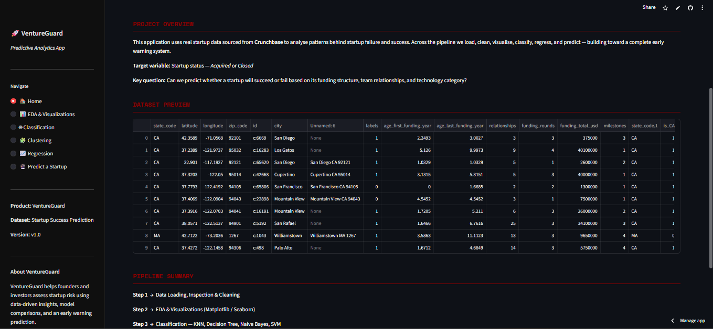
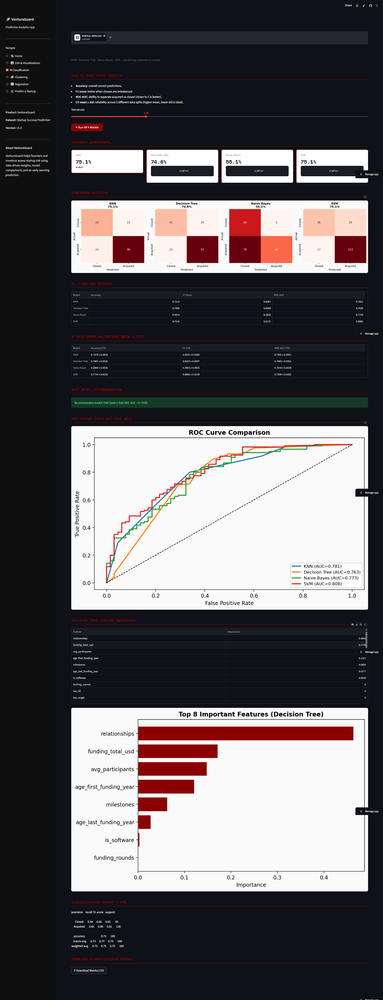

# VentureGuard

VentureGuard is an interactive Streamlit app for startup risk analytics.
It helps founders and investors analyze startup outcomes and estimate whether a startup is more likely to be **Acquired** or **Closed**.

## Live App

https://ventureguard.streamlit.app/

Built by Varad Miwale

## Features

- Clean and modern Streamlit interface
- Upload your own CSV dataset
- Data cleaning and validation checks
- EDA visualizations
- Classification models:
  - KNN
  - Decision Tree
  - Naive Bayes
  - SVM
- 5-fold cross-validation metrics (Accuracy, F1, ROC-AUC)
- Best model recommendation based on CV ROC-AUC
- Regression analysis (Linear and Polynomial)
- Interactive startup prediction page
- Downloadable classification metrics report

## Project Structure

- `app.py`: Main Streamlit application
- `requirements.txt`: Python dependencies
- `runtime.txt`: Python runtime version for deployment
- `.gitignore`: Files and folders to ignore in git

## Run Locally

1. Create and activate a virtual environment.
2. Install dependencies:

```bash
pip install -r requirements.txt
```

3. Start the app:

```bash
streamlit run app.py
```

## Deploy on Streamlit Community Cloud

1. Push this repository to GitHub.
2. Open Streamlit Community Cloud.
3. Click **New app**.
4. Select the repository, branch, and `app.py` as the entry file.
5. Deploy.

## Screenshots

### Home Page



### Classification Page



## Dataset Note

This app expects a startup dataset that includes a `status` column with values such as `acquired` and `closed`, plus relevant numeric feature columns.
